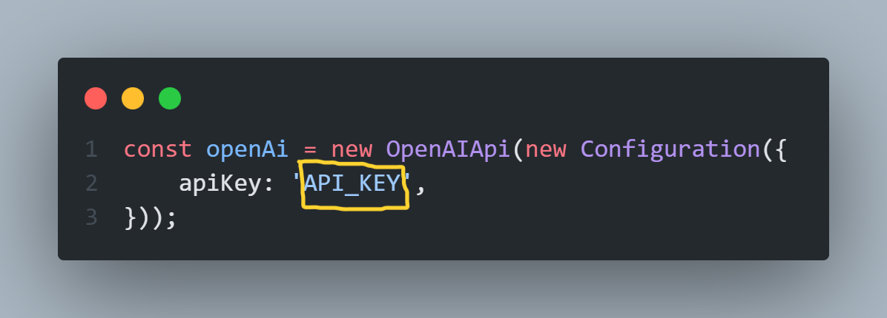

<h1 align="center">Hey Welcome To Halka-CODE</h1>
<p align="center">I love to crate Web App</p>

### I am student of Programming Hero Batch 7 😊😊 

This is a  Practise Project .   
And it's free for everyone . 

<h1 align="center">How To use it.....</h1>

| Dependencies | Versions |  
|------------|------------| 
| React | 18.2.0 | 
|Open  Ai | 3.2.1 | 
| React Spinner | 0.13.8 | 
| Tailwind CSS | 0.13.8 | 

### First , clone this repository .   
Then install npm packages . Open cmd and then run the command . 

``` 
npm install 
```
Then go to  

 ``` src>Components>Chat.jsx ``` 

 In there line no 22 replace the apiKey : 'API_key' with your api key .   
 <p align='center'></p>
 <small>Note : Only replace the api key </small>

Then  again open CMD and type 
```
npm run dev 
```
<h3 align='center'>😁😁 Enjoy Your Own ChatGPT 😁😁😁</h3>

<p>This is a fun project 🥲 </p>

## I have a request please Follow me in Github for more interesting project 🥺🥺 . 
#### Hope you keep my request 

<h2>Made With Love By <a href='https://github.com/CodeWithHasib'>Hasib Hossain</a> ❤️❤️❤️❤️ </h2>
  
<small>Any Problem ? Fell Free To Contact me : ```admin@rakibul.tech```</small>

<!-- [Image Description](./public/code.png) -->
